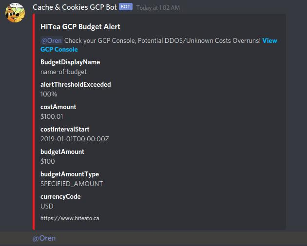
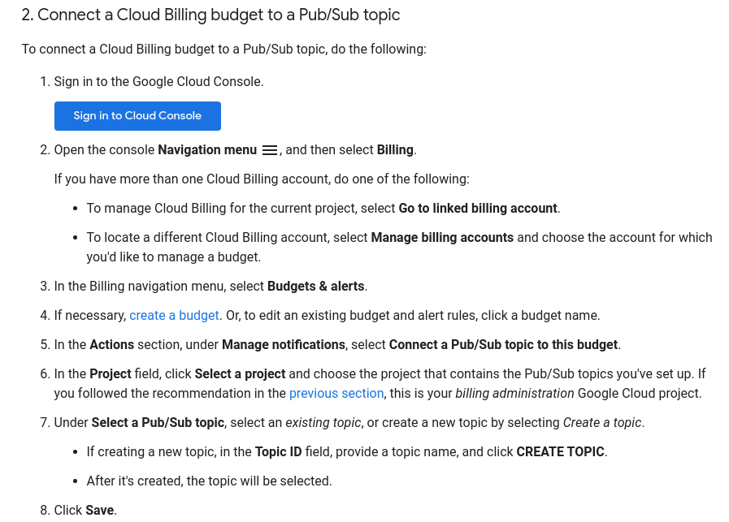

# Google Cloud Budget Alert Discord Bot Integration



## Requirements
Node.js Version 12 <br />
Discord.js Version ^12.5.1 <br />
GCP Project with Billing Enabled + (Billing Account  Administrator Role) <br />
GCP Cloud Functions <br />
GCP PubSub 

## Installation

```bash
npm install
```

Create an .env file and the required environment variables.
Sample .env can be found at .env.sample
Create an .env.yaml file and the required environment variables.
Sample .env.yaml can be found at .env.sample.yaml

## Deployment
1. Export the name of a pubsub channel (`export PUBSUBCHANNELNAME`)
2. Run `./deploy.sample.yaml`
3. Add a GCP Budget and Connect to the PubSub Channel specified about

4. Sample Data PayLoad can be found in sample-request.json. Copy and Paste it into GCP PubSub Console -> Publish Message -> Message Body 

## TODO
- add Docker Support For Cloud Run
- add AWS Lambda Support
- add unit and integration testing

## Additional Resources
- https://cloud.google.com/billing/docs/how-to/budgets-programmatic-notifications
- https://cloud.google.com/billing/docs/how-to/notify
- https://cloud.google.com/functions/docs/calling/pubsub
- https://discord.js.org/#/docs/main/stable/general/welcome

##### By Oren Leung o.leung@cacheandcookies.ca